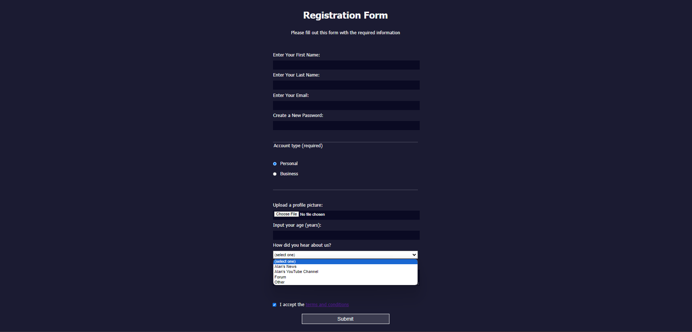

<h1>Registration Form</h1>
This is a simple registration form project created using HTML and CSS. The purpose of this project is to demonstrate the implementation of a basic user registration form with styling.

<h2>Project Structure</h2>
The project consists of the following files and directories:

index.html: This is the main HTML file that contains the structure and content of the registration form.

styles.css: This is the CSS file that is linked to the index.html file. It contains the styles and layout rules that define the visual appearance of the form.

